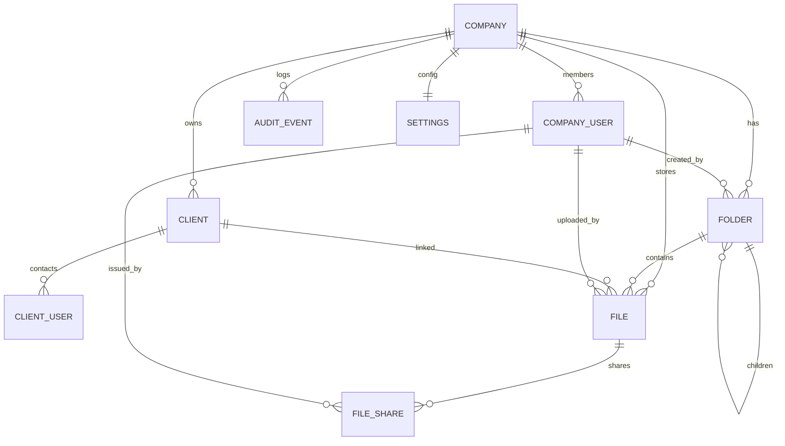

# Teuportal Core Database

## Quick Facts
- PostgreSQL with `pgcrypto`; Flyway migrations define the schema under `apps/core-api-spring/src/main/resources/db/migration`.
- Tenant data lives in public schema tables; helper functions sit under the `app` schema.
- Open transactions must apply `SET LOCAL app.company_id` (and `app.user_id` when known) before touching tenant tables.

## Tenancy & Request Context
- `app.current_company_id()` / `app.current_user_id()` expose the values set by the request filter.
- `app.require_company_id()` guards every policy; it raises if the request context is missing.
- `app.company_user_can_manage(company_id)` returns true for OWNER/ADMIN members handling privileged operations.
- Controllers must run inside a transaction so `SET LOCAL` sticks to the connection and RLS sees the variables.

## Tenant Tables
| Table | Scope | Highlights |
| --- | --- | --- |
| `company` | Tenant | Single row in OSS; unique `slug`; `app.touch_updated_at` trigger maintains `updated_at`. |
| `company_user` | Tenant | Member roster with role enum; email unique per company (case-insensitive). |
| `client` | Tenant | External organizations; composite indexes on `(company_id, name)` for lookups. |
| `client_user` | Tenant | Contacts tied to a `client`; unique per `(company, client, email)`. |
| `folder` | Tenant | Hierarchical tree, `parent_id` nullable, unique sibling names enforced via computed key. |
| `file` | Tenant | File metadata plus optional `client_id` and `folder_id`; unique `(company_id, storage_key)`. |
| `file_share` | Tenant | Public link metadata; token unique per company, optional `passcode_hash`. |
| `audit_event` | Tenant | Structured JSON `meta`, indexed by `(company_id, occurred_at DESC)` and `type`. |
| `settings` | Tenant | One row per company with `configured` flag and JSON `preferences`. |

## Global Support Tables
- `login_token` tracks magic link nonces and expirations (not tenant-scoped).
- `spring_session` and `spring_session_attributes` back Spring Session JDBC storage.

## Row Level Security
- `V2__rls_bootstrap.sql` enables and forces RLS on `company`, `company_user`, `client`, `client_user`, and `folder`; every tenant table has an isolation policy that calls `app.require_company_id()`.
- Mutation policies reuse `app.company_user_can_manage` where elevated rights are needed and fall back to self-service updates for member profiles.
- Additions to the schema must `ENABLE` + `FORCE` RLS before defining policies and should continue to revoke `PUBLIC` rights.

## Functions & Triggers
- `app.touch_updated_at()` trigger keeps `updated_at` fresh on major tenant tables.
- `app.first_company_id()` is a SECURITY DEFINER helper for migrations/bootstrapping tasks that need a deterministic tenant id.

## Schema Diagram

